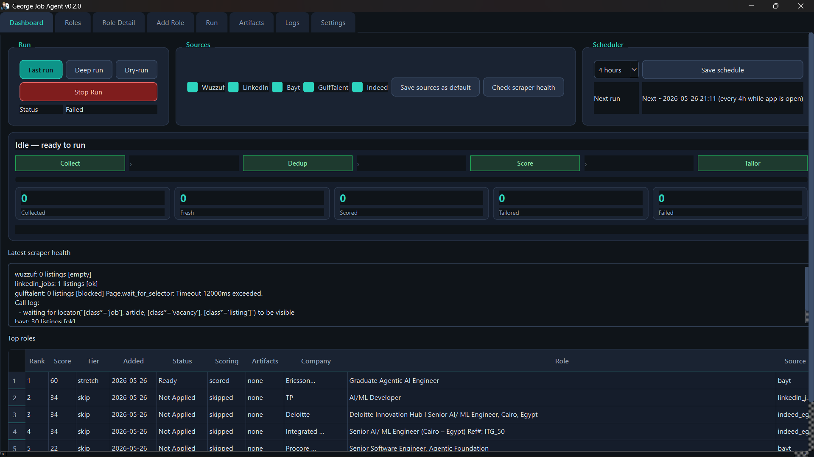
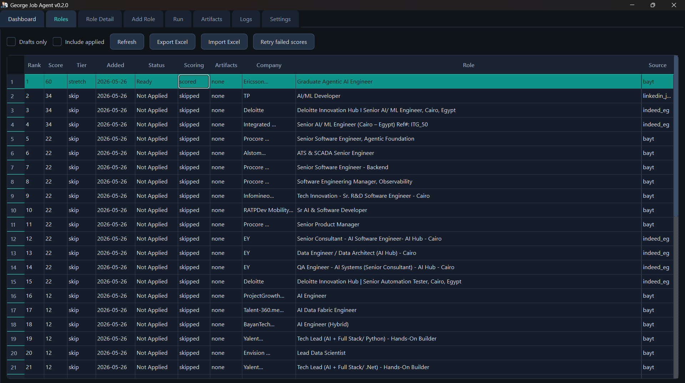
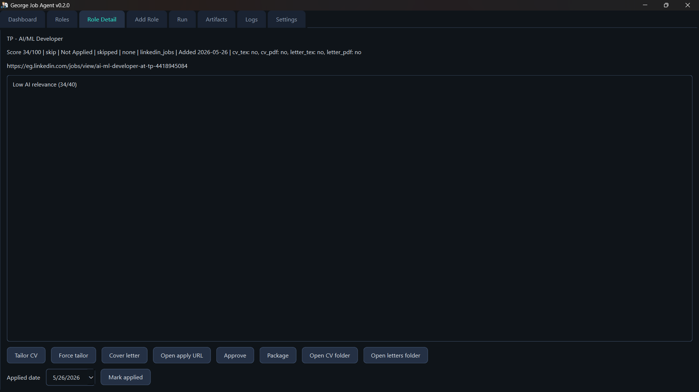
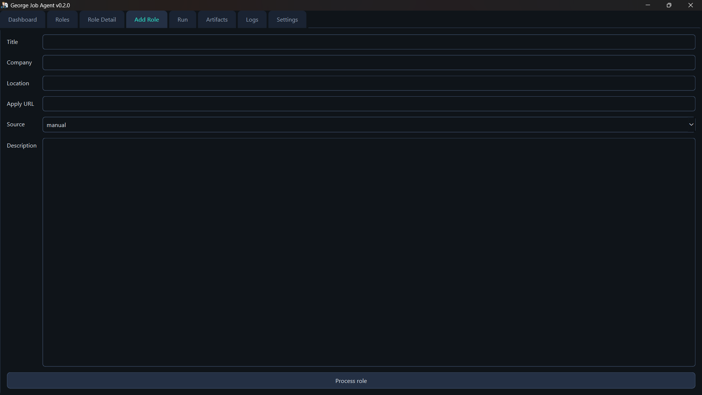
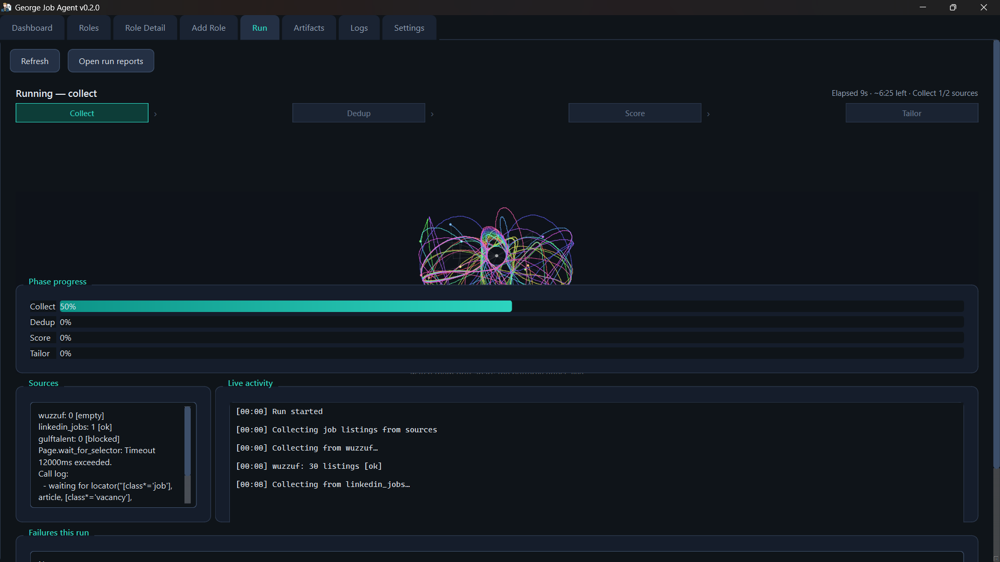
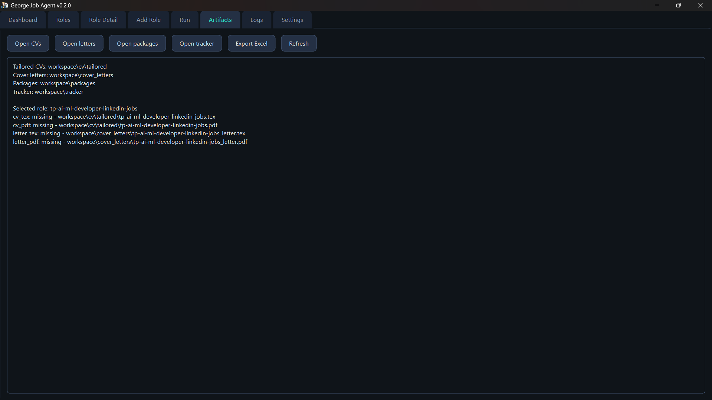

# George Job Agent Desktop

Native Windows desktop app and CLI for George Emil Sadek's AI/ML job search workflow.

The app searches Egyptian job boards, scores roles against George's profile, tailors ATS-friendly CVs and cover letters, tracks roles locally in SQLite, and exports Excel workbooks when needed. It is local-first: no website deployment and no public dashboard.

## Prerequisites

- Windows 10/11
- Python 3.11 or later for source runs
- Playwright Chromium for Bayt, GulfTalent, and Indeed (deep runs)
- TeX Live or MiKTeX is optional. Without `pdflatex`, the app saves `.tex` artifacts only.

## Install For Source Runs

```powershell
python -m venv .venv
.\.venv\Scripts\python.exe -m pip install -r requirements.txt
.\.venv\Scripts\python.exe -m playwright install chromium
copy .env.example .env
```

Start the desktop app:

```powershell
.\.venv\Scripts\python.exe -m agent desktop
```

## Run modes

| Mode | Sources | Indeed | Playwright scrapers |
|------|---------|--------|---------------------|
| **Fast** (default) | Wuzzuf, LinkedIn, enabled httpx sources | Off | Skipped when `SKIP_SLOW_SOURCES=true` |
| **Deep** | All enabled + Indeed | On | Bayt, GulfTalent, Indeed |

- **Fast run** / **Deep run** buttons on the Dashboard
- **Stop Run** cancels cooperatively between scrapers, scores, and artifacts
- Live progress: `Collected | Fresh | Scored | Tailored | Failed`
- Run reports: `workspace/logs/runs/latest.json` (updated each phase)

## Local Config

See [`.env.example`](.env.example) for all options. Key settings:

```env
ENABLED_SOURCES=wuzzuf,linkedin,bayt
SKIP_SLOW_SOURCES=true
ENABLE_INDEED=false
SCORING_MODEL_FAST=
MAX_SCORING_CANDIDATES=30
PERSIST_DRY_RUN_SCORES=true
```

`linkedin` in `ENABLED_SOURCES` maps to the `linkedin_jobs` scraper internally.

Source toggles in the desktop UI can be saved to `workspace/config/run_sources.json`.

## Repository layout

| Path | Purpose |
|------|---------|
| `agent/` | Application code (orchestrator, scrapers, desktop, tracker) |
| `agent/desktop/assets/` | App icon (`app.ico`, `app.png`) |
| `workspace/memory/` | Seeded profile/CV facts (bundled in EXE) |
| `workspace/tracker/` | SQLite DB + optional Excel seed workbook |
| `cv_variations/` | Canonical CV PDF archive for tailoring context |
| `tests/` | Pytest suite |
| `packaging/` | PyInstaller spec |
| `scripts/` | `build_desktop.ps1`, `clean_local.ps1` |

Runtime outputs (gitignored): `workspace/logs/`, `workspace/cv/tailored/`, `build/`, `dist/`.

## App Experience

### Dashboard

The Dashboard provides a high-level overview of your job search operations. It offers controls for different run modes (Fast run, Deep run, Dry-run), allows you to toggle specific job boards, and includes a scheduler for automated runs. You can monitor real-time scraper health, track the progress of pipeline phases, and quickly view the top-ranked roles.

### Roles

The Roles screen offers a comprehensive table of all processed job listings. You can filter roles, retry any failed AI scorings, and import/export the entire pipeline to Excel. It displays critical metrics for each role such as its AI rank, score, processing status, company name, and source.

### Role Detail

The Role Detail screen provides an in-depth look at a specific job listing. Here, you can review the AI's relevance evaluation and scoring breakdown. It offers actionable controls to tailor your CV, generate a targeted cover letter, open the original application URL, package your artifacts, and mark the role as applied.

### Add Role

The Add Role screen allows you to manually input job listings discovered outside the automated scraping pipeline. You can provide the job title, company, location, application URL, and the full job description to seamlessly integrate it into the scoring and tailoring workflow.

### Run

The Run screen gives you live tracking while an active job pipeline is executing. It features a visual phase stepper indicating overall progress across the Collect, Dedup, Score, and Tailor stages. It also provides a live activity feed showing real-time logs from the active scrapers and any encountered failures.

### Artifacts

The Artifacts screen helps you manage all generated documents and application materials. It lists the directory paths for tailored CVs, cover letters, and application packages, while providing quick access buttons to open these folders directly on your system, ensuring everything is ready before submission.

### Settings
The Settings screen provides configuration for your workspace paths, displays the resolved local environment config, and includes a setup wizard to ensure your API keys and prerequisites are correctly established.

## CLI Reference

| Command | Description |
|---|---|
| `python -m agent desktop` | Start the desktop app |
| `python -m agent run` | Full cycle (fast by default) |
| `python -m agent run --deep` | Deep cycle (Indeed + slow scrapers) |
| `python -m agent run --dry-run` | Score only |
| `python -m agent status` | Top roles + active run progress if running |
| `python -m agent scrape-health` | Quick card collect per source |
| `python -m agent schedule` | CLI scheduler (terminal must stay open) |

## Build The Windows App

```powershell
.\scripts\build_desktop.ps1 -Clean
```

Output: `dist\GeorgeJobAgent\GeorgeJobAgent.exe`

## Tests

```powershell
.\.venv\Scripts\python.exe -m ruff check .
.\.venv\Scripts\python.exe -m pytest tests/ -q
```

See [CONTRIBUTING.md](CONTRIBUTING.md) for cleanup and commit guidelines.

## Scheduler

- **Desktop**: Dashboard scheduler uses `workspace/config/schedule.json`. The app must stay open; the label shows the approximate next run time.
- **CLI**: `python -m agent schedule` uses APScheduler in the terminal (also requires the process to stay open).
- Intervals supported in the desktop UI: 1, 2, 4, 6, 8, 12, and 24 hours.

## Troubleshooting

| Symptom | What to check |
|---------|----------------|
| All scores show `0` / tier `skip` | OpenRouter key in Settings; use **Retry failed scores** on the Roles tab; roles filtered before LLM show prefilter scores after refresh |
| Dark theme missing in dev | Fixed in `agent/desktop/theme` — restart the app |
| Bayt/GulfTalent/Indeed empty | Run **Check scraper health** on the Dashboard; install Chromium via setup |
| Excel import missing columns | Re-export after upgrading — export now includes scoring/artifact/ATS columns |

## Rules

- The app never invents qualifications, employers, or metrics.
- Applications are marked applied only when you confirm them.
- Existing applied/interviewed rows are not overwritten.
- Keep `.env` private; rotate any exposed OpenRouter key.
